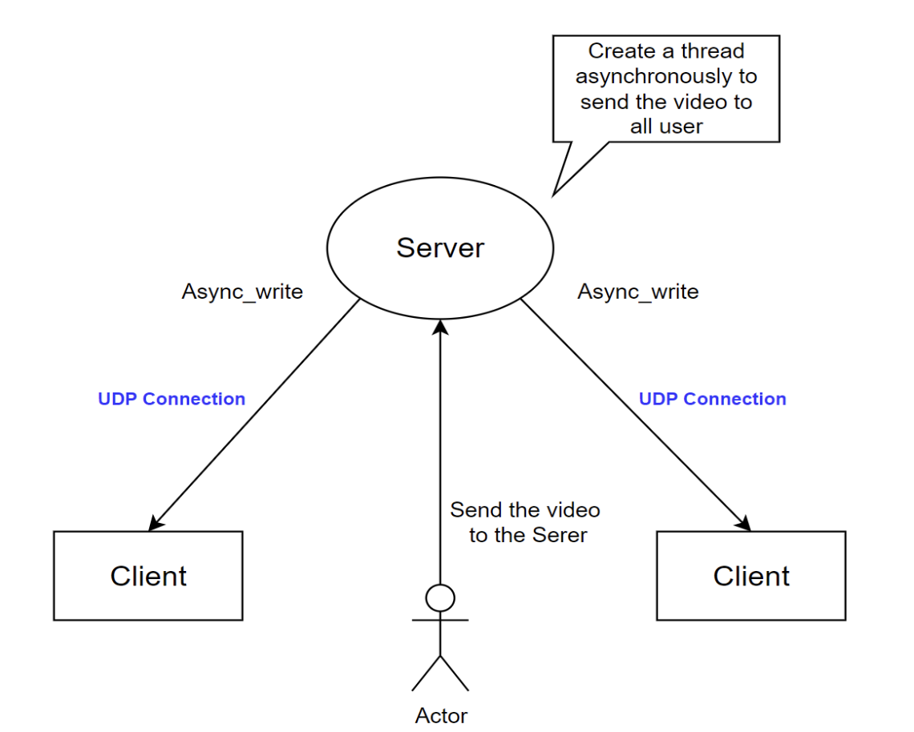

# 2023-1 IoT_Project

**IoT 실습

Final Project 계획서

21800201 김현욱

21800471 유준호

주제0

라이브 영상 스트리밍 시스템 개발

설명

영상 제공자가 서버에 단대단으로 전송한 스트리밍 미디어를 다시 IP 멀티캐스트 형태로 각 단말에 일대다 형태로 전송.

Protocol

RTP(Realtime Transport Protocol)를 이용하여 영상을 실시간성이라는 조건에 부합하도록 영상을 전송한다.

RTP는 실시간 비디오, 오디오 및 데이터를 전송하는 데 사용하는 프로토콜이다. RTP는 실시간성을 중요하게 생각하기 때문에 TCP가 아닌, UDP를 기반으로 사용한다. UDP가 데이터를 데이터그램 단위로 나뉘 패킷 스위칭을 통해 효율적이고 빠르게 전송하는 방법에 대한 규칙이라면, RTP는 UDP 윗 단에서 작용하는, 전송할 패킷을 어떤 코덱으로 인코딩하고, 수신한 패킷을 어떤 코덱으로 디코딩할지에 대한 규칙을 말한다.

최초 영상만 전체 프레임을 전송하여 이후 프레임과의 차이를 이용해 바뀐부분만 전송하게된다. 이를 통해 전송하는 데이터의 양을 크게 줄일 수 있으며 실시간성을 확보한다.

RTP 프로토콜은 스트리밍 미디어의 단대단 실시간 전송을 위해 설계되었으며 지터 보상, 패킷 손실 및 누락 감지를 위한 기능을 제공한다. 패킷의 시퀀스 번호와 타임스탬프를 이용해 실시간 데이터의 순서와 타이밍을 유지하여 비동기적으로 실행되는 RTP프로토콜에서 실시간 스트림을 제공할 수 있다.

System Scatch

**

**UDP 소켓 생성 후 로컬 Endpoint와 Binding을 하고 Actor로부터 비디오 데이터를 수신하면 해당 데이터를 그대로 Client에게 비동기적으로 보내는 방식으로 구현하고자 한다. 이 때 사용자에게 보여지는 GUI는 OpenCV라이브러리를 이용하여 기능을 제공할 것이다.

**

**주제1

실시간 연주 공유(음악 데이터) 서비스

: VoIP 프로토콜을 이용하여, 연결 이후 실시간성 유지를 위해 최소한의 지연성을 고려하여 데이터를 전달하고 클라이언트들 간의 동기화 작업이 필요.

**

**주제2

실시간 위치 추적 서비스 구현

: MQTT를 사용해서 사용자의 위치 정보를 실시간으로 추적하고 공유할 수 있는 서비스. (사용자 동의 정보가 중요)

* 사용하는 WiFi의 IP/MAC Address를 파악해서 현재 어떤 장소에 있는지 판별하여 사용자에게 위치를 제공하는 기능.
* GPS 정보를 보내서 현재 위치 정보를 계산하여 원하는 사용자에게 대략적인 위치 정보를 제공하는 기능

  Protocal

1. 위치 정보 전송 방법
2. 오류 처리 방식
3. 보안 고려 사항

**
